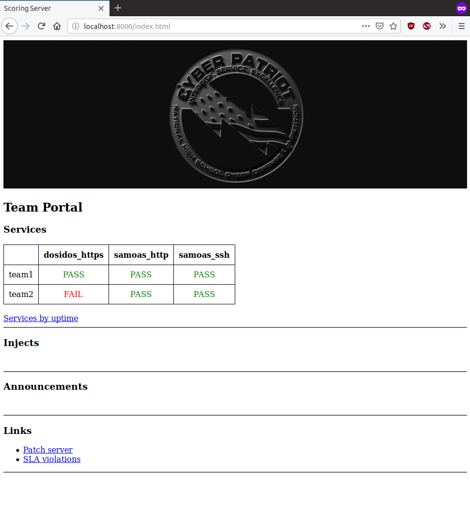
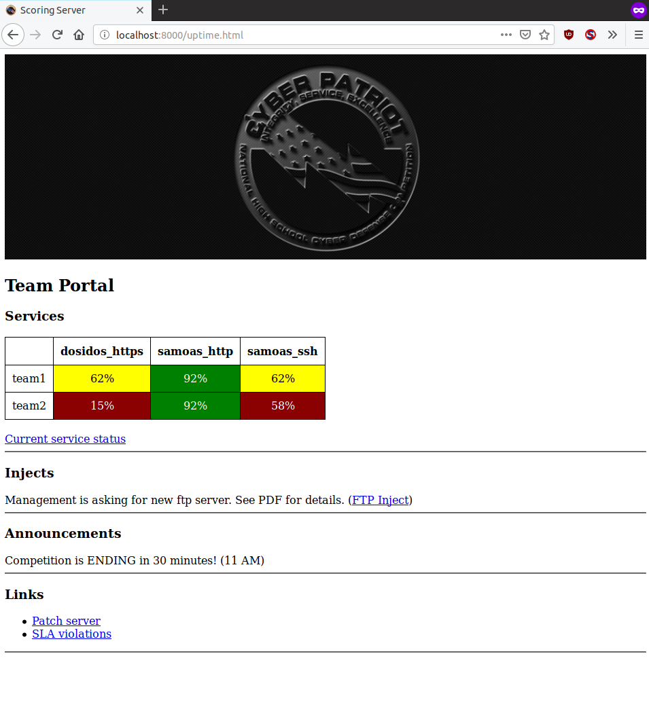
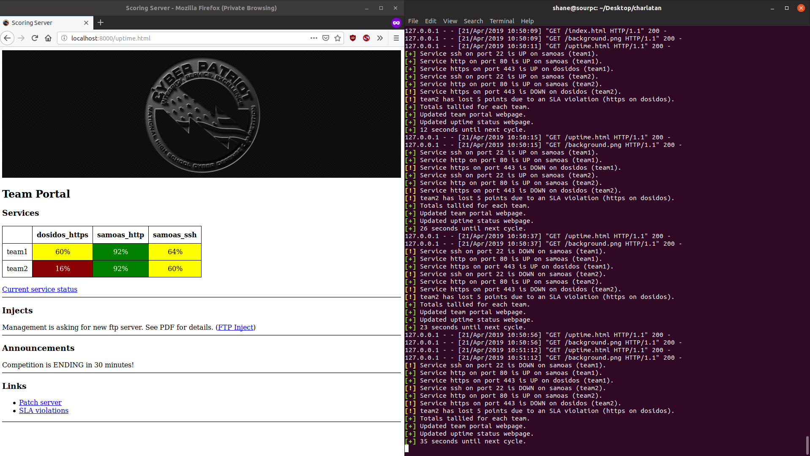

# Scoring Engine (CyberPatriot NSMC and CCDC)

__Extremely portable and simple scoring engine__. Written purely in bash. No database. Just configure it in `config` and launch with `./charlatan.sh`.

Requirements:

- `bash` _( >= version 3 )_
- `python3`
- `nmap`

## Screenshots

_Default index.html view_


_Alternative uptime.html view_


_Web output and terminal_


## Structure


```bash
.
├── charlatan.sh # entry point, runs all other scripts
├── config # edit this file to input competition, image, ip, service configurations
├── data # stores all data
│   ├── announcements # script pulls announcements from here
│   ├── global # global data (like number of checks performed) here
│   ├── injects # script pulls injects from here
│   ├── scoring_status # html for PASS/FAIL table
│   ├── sla_violations
│   ├── team1 # team folder
│   │   ├── dosidos
│   │   │   └── dosidos_https
│   │   ├── samoas
│   │   │   ├── samoas_http
│   │   │   └── samoas_ssh
│   │   └── totals # team total points, sla violations
│   ├── team2 
│   │   ├── dosidos # image name folder
│   │   │   └── dosidos_https # image service file
│   │   ├── samoas
│   │   │   ├── samoas_http
│   │   │   └── samoas_ssh
│   │   └── totals
│   └── uptime_status # html for uptime table
├── README.md
├── scripts # contains all scripts
│   ├── ccs_server.sh
│   ├── color_codes.sh
│   ├── dump_db.sh
│   ├── init_config.sh
│   ├── injector.sh
│   ├── score_cycle.sh
│   ├── sshcheck.sh
│   ├── tallyer.sh
│   ├── uptime_calculator.sh
│   ├── vgraph.sh
│   └── web_update.sh
└── web
    ├── background.png
    ├── favicon.ico
    ├── index.html
    └── patch
        ├── Firefox.exe
        └── geany-1.3
```

### Patch Server

Files in `./web/patch/` will be served with a basic Python HTTP server on patch. Put the files in there.

### Injects and Announcements

As it stands, just edit `data/injects` and `data/announcements`, and the 

### todo

better timer (will always go over time limit -- compensate for nmap, or don't even have a timer?)
add passwords and more checks
better interface for Injects, announcements, etc
checking service configs
making sure nmap is installed
being able to pause/interrupt and resume
don't call nmap fifty times when there's a bunch of services

- charlatan: initiates script, runs scripts in correct order
- ccs_server: listens and increments ccs scores
- init_config: creates filesystem from configuration
- parse_config: 
- dump_db: dumps filesystem data into single file
- web_update: updates web interface with data from fs
- injector: queues injects. allows cancelation, changing placement, etc
- announcer: same thing but for announcements
- score_cycle: scores services and increments correct files in system
- tally: tallies totals and stuff
- add_service: see name (add checks offset to accurately calculate uptime)